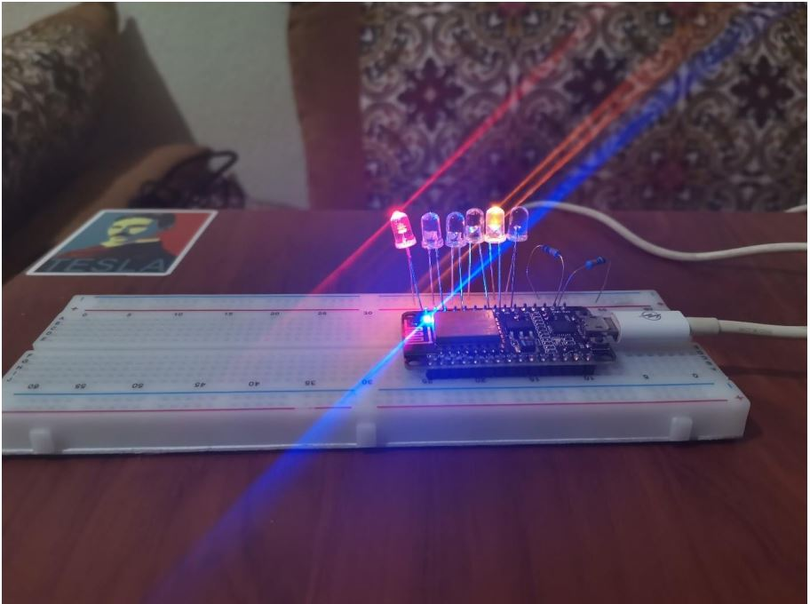

# ESP8266 Traffic Light Controller

This repository contains the C++ code for the **ESP8266** microcontroller, which serves as the traffic light controller. Each ESP8266 device represents a traffic light, managing its state (red, yellow, or green) and communicating with the Node.js server to receive updates and send status reports.

## Architecture Overview

The ESP8266 devices are part of a larger traffic light control system that includes a web and mobile application for administrators and users to monitor and control traffic lights across the city. Here’s a high-level architecture diagram of the entire system:

- **Node (Express.js) Server**: The ESP8266 device communicates with this server to report its state and receive commands.
- **MongoDB**: Used by the server to store and manage traffic light data.
- **Web and Mobile Applications**: Interfaces for users to interact with the traffic lights.
- **ESP8266 Web Server**: Each ESP8266 device hosts a web server to handle communication and control requests.

## ESP8266 Components and Assembly

This setup simulates a traffic light using two sets of three LEDs (red, yellow, green) to represent different light states. The assembly uses the following components:
- **ESP8266 microcontroller**: The main processor, programmed to handle HTTP requests from the server and control the LEDs.
- **2 x 3 LEDs**: Each set of three LEDs simulates a traffic light (one for each color).
- **Resistors and Breadboard**: For LED connections and stable current.

Below is an image of the assembly layout:

## Features

This code allows the ESP8266 to:
- **Report its current state** to the server (active color: red, yellow, or green).
- **Receive and process state change requests** from the server.
- **Turn the traffic light on/off** based on commands received from the server.

## Communication with the Server

The ESP8266 uses HTTP requests to communicate with the Node.js server:
- **Status Update**: Sends its current traffic light state at regular intervals.
- **Control Requests**: Receives requests from the server to change its state (e.g., switching from red to green) or turn the light on/off.

This setup ensures seamless synchronization between the traffic light hardware and the backend server.

## Usage

1. **Setup the Hardware**: Connect the ESP8266 to two sets of LEDs on a breadboard as shown in the assembly image.
2. **Upload Code**: Flash the ESP8266 with this repository's code.
3. **Start the System**: Connect the ESP8266 to Wi-Fi and ensure it communicates with the Node.js server.
